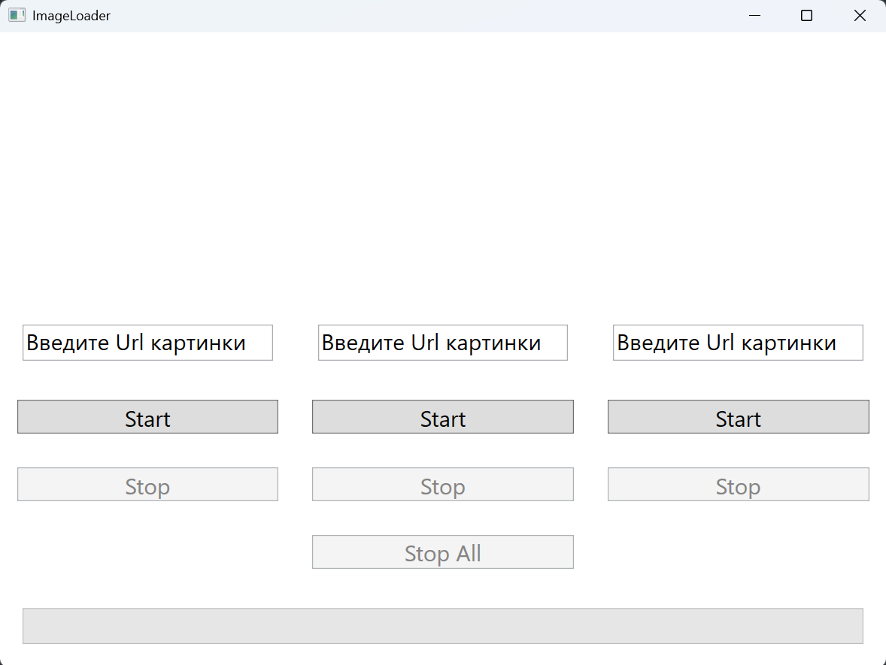

# Загрузчик картинок 

---
## Описание проекта
### В данном проекте есть 3 поля Image, по кнопке Start и Stop для каждого Image, кнопка StopAll для остановки загрузки всех картинок из интернета

---
## Реализация MVVM

### View

####  -  MainWindow.xaml - главный экран для взааимодействия с приложением

### ViewModel

#### - StartViewModel.cs - Файл, который хранит данные для отображения всех Image, а также взаимодействие с StartModel

#### - StopViewModel.cs - Файл, в котором реализована остановка загрузки картинок

#### - ImageConverter.cs - Файл, в котором реализован класс ImageConverter

### Model

#### - StartModel.cs - Файл, в котором реализована загрузка картинок

#### - Progress.cs - Файл, в котором реализована логика отображения ProgressBar

#### - ProgressState.cs - Файл, в котором хранится Enum для отслеживания состояния загрузки

### Commands

#### - RelayCommand.cs - Файл, в котором реализован класс RelayCommand для взаимодействия с View

--- 

## TODO:
### [X] Реализовать загрузку одной картинки

### [X] Реализовать загрузку нескольких картинок

### [X] Реализовать остановку загрузки   
 
### [X] Реализовать остановку всех картинок

### [X] Реализовать StopAll

### [X] Реализовать ProgressBar

---

## Внешний вид программы
